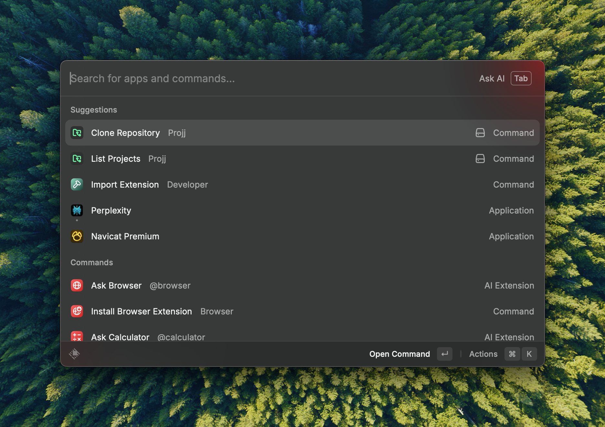

<div align="center">

</div>


A [projj](https://github.com/popomore/projj) extension for [Raycast](https://raycast.com) to help you quickly manage and access local projects.


## Features

- **Project List**: Quickly browse all projects managed by projj
- **Smart Operations**: Support opening projects in Cursor, Terminal, and Finder
- **Clone Repository**: Clone projects directly from Git URL to projj managed directory
- **Quick Search**: Find projects quickly through Raycast search bar

## Installation & Usage

### Prerequisites
1. Install [Raycast](https://raycast.com) and [projj](https://github.com/popomore/projj)
2. Initialize projj configuration: `projj init`

### Install Extension
```bash
pnpm install
pnpm run build
```
Then import the extension into Raycast.

## Main Commands

### List Projects
- View all projects managed by projj
- Support opening in Cursor, Terminal, and Finder
- Copy project path and Git URL

### Clone Repository  
- Enter Git URL to clone repository
- Select target directory
- Automatically execute projj clone operation

## Configuration

The extension automatically reads projj configuration files:
- `~/.projj/config.json`: projj configuration
- `~/.projj/cache.json`: project cache

## Related Links

- [Raycast](https://raycast.com) - Powerful macOS productivity tool
- [projj](https://github.com/popomore/projj) - Local project management tool
- [Cursor](https://cursor.sh) - AI-powered code editor
- [Warp](https://warp.dev) - Modern terminal tool